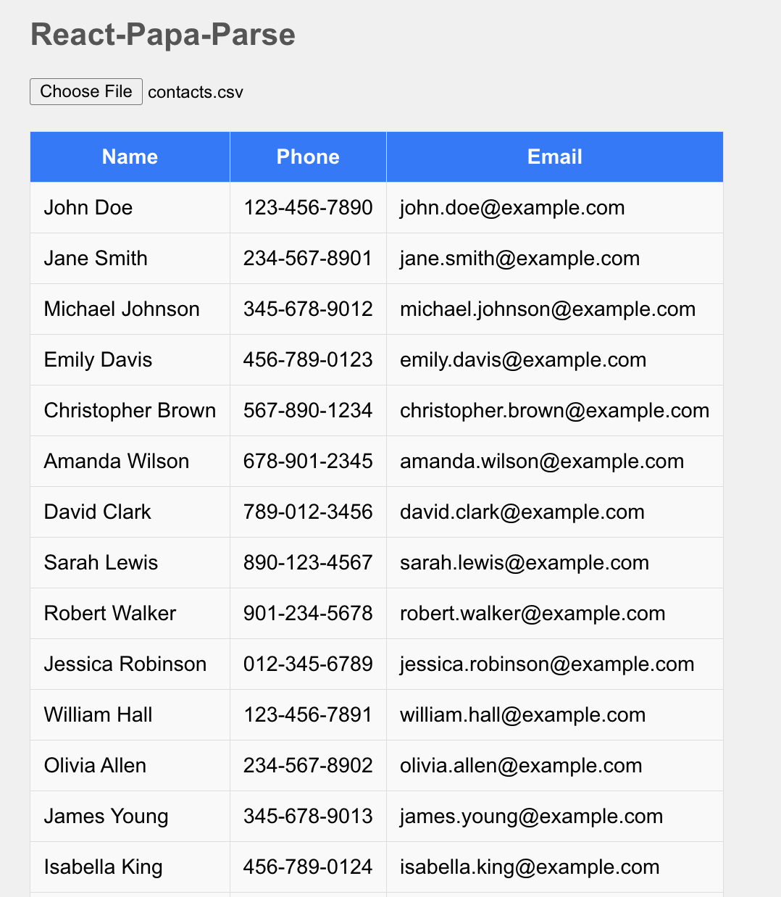

# CSV Parser Showcase





This project showcases various CSV parsing libraries integrated into a React application. The libraries included are:

1. **React-Papa-Parse**
2. **React CSV Reader**
3. **React Parse CSV**
4. **@uiw/react-csv-reader**
5. **React CSV Importer**

This public repository is a colloboration with a blog with OneSchema. [Link to Blog Here.]()

## Getting Started

These instructions will help you set up and run the project on your local machine.

`cd csv-parsers; npm install; npm start`

### Prerequisites

You need to have Node.js and npm installed. You can download them from [nodejs.org](https://nodejs.org/).

### Installation

1. Clone the repository:
   ```sh
   git clone https://github.com/sun2ii/csv-parsers.git
   cd csv-parsers
   ```

### License 

This project is licensed under the MIT License. You are free to use, copy, modify, merge, publish, distribute, sublicense, and/or sell copies of the software. The software is provided "as is", without warranty of any kind. See the LICENSE file for more details.